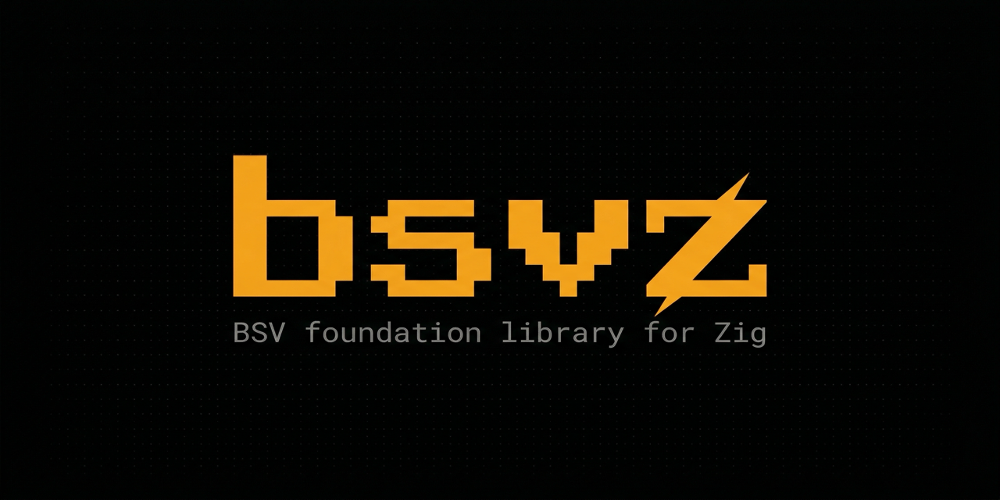

# bsvz

BSV foundation library for Zig. Covers primitives, crypto, script execution, and transaction handling.

## Table of Contents

- [Status](#status)
- [Getting Started](#getting-started)
- [Module Layout](#module-layout)
- [Script Verification APIs](#script-verification-apis)
- [Interpreter Coverage](#interpreter-coverage)
- [Benchmarks](#benchmarks)

## Status

The script engine is the mature core. SPV and broadcast are stubs.

<details>
<summary>Details</summary>

**Implemented:**

- `primitives`: hex, varint, base58, base58check, network/version-byte helpers
- `crypto`: sha256, hash256, ripemd160, hash160, secp256k1 private/public keys, secp256k1 point API, DER signatures, tx-signature helpers
- `compat`: P2PKH address and WIF encode/decode
- `transaction`: transaction parse/serialize, txid, replay-protected sighash/preimage helpers, P2PKH spend helpers
- `script`: ScriptNum, byte helpers, script parser/chunks, broad opcode set, execution engine, transaction-aware CHECKSIG/CHECKMULTISIG, Go-shaped policy enforcement, P2PKH and OP_RETURN templates

**Go corpus accounting:**

- All 1,499 rows in Go's `script_tests.json` are accounted for
- 1,438 executable exact-row references are in the suite
- 61 rows are explicitly tracked as non-executable header/comment/meta rows
- A 1,099-row filtered bulk-corpus lane and focused sigcheck/multisig lanes are also active

**Construction zones:**

- `spv`: type stubs only
- `broadcast`: namespace scaffolding only
- Runar local acceptance is broad but not complete

</details>

## Getting Started

**Requirements:** Zig `0.15.2`

Add `bsvz` to your `build.zig.zon`:

```zig
.dependencies = .{
    .bsvz = .{
        .url = "https://github.com/bsv-blockchain/bsvz/archive/<commit>.tar.gz",
        .hash = "<hash>",
    },
},
```

Then add it to your `build.zig`:

```zig
const bsvz = b.dependency("bsvz", .{ .target = target, .optimize = optimize });
exe.root_module.addImport("bsvz", bsvz.module("bsvz"));
```

Run tests:

```bash
zig build test
```

Run the optional Runar acceptance lane:

```bash
zig build test-runar-acceptance
```

## Module Layout

| Module | Description |
| --- | --- |
| `bsvz.primitives` | Hex, varint, base58, base58check, version-byte helpers |
| `bsvz.crypto` | SHA256, RIPEMD160, secp256k1 keys and point API, DER signatures |
| `bsvz.script` | Script parser, opcode set, execution engine, policy flags |
| `bsvz.transaction` | Parse, serialize, sighash, P2PKH spend helpers |
| `bsvz.compat` | P2PKH address and WIF encode/decode |
| `bsvz.spv` | Construction zone |
| `bsvz.broadcast` | Construction zone |

## Script Verification APIs

The verification surface covers plain script pairs, full prevout spends, detailed results, and step traces.

<details>
<summary>API reference and examples</summary>

### Entry points

| Function | Description |
| --- | --- |
| `bsvz.script.thread.verifyScripts(...)` | Verify a plain unlocking/locking script pair |
| `bsvz.script.thread.ScriptThread.verifyPair(...)` | Same, on a reusable thread |
| `bsvz.script.thread.verifyExecutableScripts(...)` | Verify an executable/full-locking-script pair |
| `bsvz.script.thread.verifyPrevoutSpend(...)` | Verify a spend against a previous output |
| `bsvz.script.thread.verifyPrevoutSpendDetailed(...)` | Same, with structured result |
| `bsvz.script.thread.verifyPrevoutSpendTraced(...)` | Same, with step trace |
| `bsvz.script.interpreter.verify(...)` | Small wrapper for simple verification |
| `bsvz.script.interpreter.verifyPrevout(...)` | Small wrapper for prevout verification |
| `bsvz.script.interpreter.verifyDetailed(...)` | Detailed result variant |
| `bsvz.script.interpreter.verifyTraced(...)` | Traced variant |

**Return shapes:**

- `true` / `false`: script evaluated cleanly, result is the final truthiness
- `error.*`: policy, parsing, encoding, or transaction-context failure; `result.terminal` gives `.success`, `.false_result`, or `.script_error`

**Detailed result fields:** `result.phase`, `result.script_error`

**Trace step fields:** phase, opcode offset, opcode byte, pre-step stack/altstack/condition-stack snapshots, `ops_executed`, `last_code_separator`

Both `VerificationResult` and traced results have `writeDebug(...)` helpers.

### Minimal pair verification

```zig
var thread = bsvz.script.thread.ScriptThread.init(.{ .allocator = allocator });
defer thread.deinit();

const ok = try thread.verifyPair(
    bsvz.script.Script.init(unlocking_bytes),
    bsvz.script.Script.init(locking_bytes),
);
```

### Prevout spend verification

```zig
const previous_output = previous_tx.outputs[previous_output_index];

var result = bsvz.script.interpreter.verifyPrevoutDetailed(.{
    .allocator = allocator,
    .tx = &spend_tx,
    .input_index = spend_input_index,
    .previous_output = previous_output,
    .unlocking_script = spend_tx.inputs[spend_input_index].unlocking_script,
});
defer result.deinit(allocator);

if (result.terminal == .script_error) return result.script_error.?;
const ok = result.success;
```

### Step trace

```zig
var traced = bsvz.script.thread.verifyScriptsTraced(.{
    .allocator = allocator,
}, bsvz.script.Script.init(&[_]u8{}), bsvz.script.Script.init(&[_]u8{
    @intFromEnum(bsvz.script.opcode.Opcode.OP_1),
    @intFromEnum(bsvz.script.opcode.Opcode.OP_FROMALTSTACK),
}));
defer traced.deinit(allocator);

try traced.writeDebug(std.io.getStdOut().writer());
```

### Output serialization

```zig
const output = bsvz.transaction.Output{
    .satoshis = 42,
    .locking_script = bsvz.script.Script.init(&[_]u8{0x6a}),
};

var raw = try allocator.alloc(u8, output.serializedLen());
defer allocator.free(raw);
_ = output.writeInto(raw);

const parsed = try bsvz.transaction.Output.parse(raw);
const hash_all = try bsvz.transaction.Output.hashAll(allocator, &[_]bsvz.transaction.Output{output});
```

### Examples

- Plain script trace: [./examples/script_trace_demo.zig](./examples/script_trace_demo.zig)
- Prevout spend trace: [./examples/prevout_trace_demo.zig](./examples/prevout_trace_demo.zig)
- Hash demo: [./examples/hash_demo.zig](./examples/hash_demo.zig)

### secp256k1 point API

`bsvz.crypto.Point`: `fromCompressedSec1`, `fromRaw64`, `toCompressedSec1`, `toRaw64`, `xBytes32`, `yBytes32`, `add`, `mul`, `negate`

</details>

## Interpreter Coverage

<details>
<summary>Coverage map</summary>

| Area | Status | Notes |
| --- | --- | --- |
| Script bytes, chunks, parser, serializer | implemented | direct pushes, `PUSHDATA1/2/4`, chunk roundtrip, malformed pushdata rejection |
| Script thread / seam orchestration | implemented | separates seam behavior from the opcode loop; owns the "full previous locking script for sighash, executable prefix for execution" split |
| Push-only and script inspection helpers | implemented | `isPushOnly`, `hasCodeSeparator`, top-level `OP_RETURN` tail handling |
| Execution core | implemented | stack, altstack, condition stack, truthiness, op counting, stack limits |
| Control flow | implemented | `IF`, `NOTIF`, `ELSE`, `ENDIF`, `VERIFY`, legacy vs post-Genesis multi-`ELSE`, post-Genesis `OP_RETURN`, `CODESEPARATOR` |
| Stack ops | complete | `DUP`, `DROP`, `SWAP`, `ROT`, `ROLL`, `PICK`, `2DUP`, `2DROP`, `2OVER`, `2ROT`, `2SWAP`, `3DUP`, `IFDUP`, `TOALTSTACK`, `FROMALTSTACK`, `TUCK` |
| Byte/splice ops | broad | `CAT`, `SPLIT`, `NUM2BIN`, `BIN2NUM`, `SIZE` |
| Bitwise ops | implemented | `INVERT`, `AND`, `OR`, `XOR`, `LSHIFT`, `RSHIFT` |
| Numeric and boolean ops | broad | `ADD`, `SUB`, `MUL`, `DIV`, `MOD`, comparisons, min/max, within, boolean logic |
| Hash ops | implemented | `RIPEMD160`, `SHA1`, `SHA256`, `HASH160`, `HASH256` |
| `ScriptNum` | implemented | small-or-big numeric core using Zig stdlib bigint for promoted values |
| `CHECKSIG` | implemented | transaction-aware, legacy and ForkID paths, `CODESEPARATOR` handling, scriptCode normalization |
| `CHECKMULTISIG` | implemented | transaction-aware, post-Genesis behavior, early-exit, `NULLDUMMY`/`NULLFAIL`/ForkID policy |
| Policy flags | broad | `strict_encoding`, `der_signatures`, `low_s`, `strict_pubkey_encoding`, `null_dummy`, `null_fail`, `sig_push_only`, `clean_stack`, `minimal_data`, `minimal_if`, `discourage_upgradable_nops`, `verify_check_locktime`, `verify_check_sequence` |
| CLTV / CSV / upgradable NOPs | partial | tx-aware legacy/reference semantics behind explicit flags; modern BSV profile treats them as inert unless policy enables them |
| Numeric minimal-encoding parity | implemented | minimal push and minimal numeric decoding enforced where Go applies `MINIMALDATA` |
| `CODESEPARATOR` parity | broad | legacy and ForkID scriptCode behavior, chained separator tests, parser/scanner coverage |
| Go parity vectors | full | all 1,499 rows in Go's `script_tests.json` accounted for; 1,438 executable exact-row references; 61 non-executable rows explicitly tracked |
| Runar conformance | smoke lane | `zig build test` runs `tests/runar_conformance.zig`; full acceptance suite is `zig build test-runar-acceptance` |
| SPV / proof tooling | construction zone | not part of the interpreter core |

**Scope:**

- Modern BSV script execution and post-Genesis behavior
- HD wallet derivation is out of scope for the core library

</details>

## Benchmarks

<details>
<summary>Harnesses and results (Apple M3 Max)</summary>

**Harnesses:**

```bash
# bsvz interpreter
zig build bench

# Go SDK comparison
cd benchmarks/go_sdk && GOCACHE=/tmp/go-build-bsvz go test -run '^$' -bench . -benchmem

# Live corpus pipeline (requires sibling bsvz-autotrainer repo)
cd ../bsvz-autotrainer && bun bench:pipe
```

Source: [./benchmarks/script_engine.zig](./benchmarks/script_engine.zig), [./benchmarks/go_sdk/script_engine_bench_test.go](./benchmarks/go_sdk/script_engine_bench_test.go)

Benchmarks use prebuilt fixtures. Key generation and per-iteration signing are excluded from the hot loop.

**Script engine (Apple M3 Max):**

| Workload | `bsvz` | `go-sdk` |
| --- | --- | --- |
| arithmetic verify | ~0.11 us/op | ~3.7 us/op |
| branching verify | ~0.10 us/op | ~4.6 us/op |
| SHA256 verify | ~0.11 us/op | ~3.9 us/op |
| HASH160 verify | ~0.28 us/op | ~4.0 us/op |
| stack ops verify | ~0.30 us/op | ~12.7 us/op |
| P2PKH verify (Go reference tx) | ~219.0 us/op | ~227.4 us/op |

**bsvz diagnostics:**

| Workload | `bsvz` |
| --- | --- |
| P2PKH sighash only | ~0.30 us/op |
| P2PKH secp verify only | ~179.9 us/op |
| P2PKH verify (synthetic fixture) | ~208.7 us/op |
| Runar arithmetic verify | ~0.55 us/op |

**Live corpus pipeline (JungleBus-style, via bsvz-autotrainer):**

| Workload | `bsvz` | `go-sdk` |
| --- | --- | --- |
| wall clock | ~1720 ms | ~1851 ms |
| tx throughput | ~1907 tx/s | ~1772 tx/s |
| parse+spend throughput | ~13121 ops/s | ~12194 ops/s |

Phase split:

| Phase | `bsvz` | `go-sdk` |
| --- | --- | --- |
| JSON DOM | ~492 ms | ~517 ms |
| tx hex decode | ~38 ms | ~59 ms |
| spend verify | ~1146 ms | ~1224 ms |

The remaining cost sits in secp verification. `bsvz` uses a secp256k1 double-base verification fast path built on Zig stdlib curve primitives, which moved full P2PKH verification from ~433 us/op down to ~199 us/op.

These numbers are a local baseline on one machine; your results will vary with allocator configuration, CPU microarchitecture, and corpus mix.

</details>
